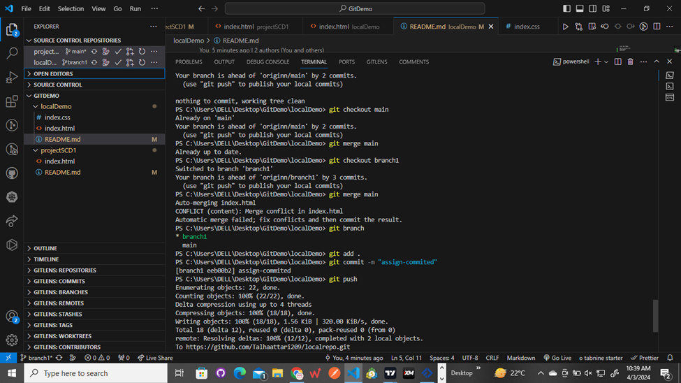
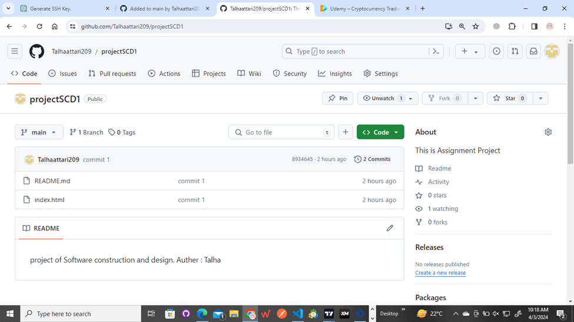
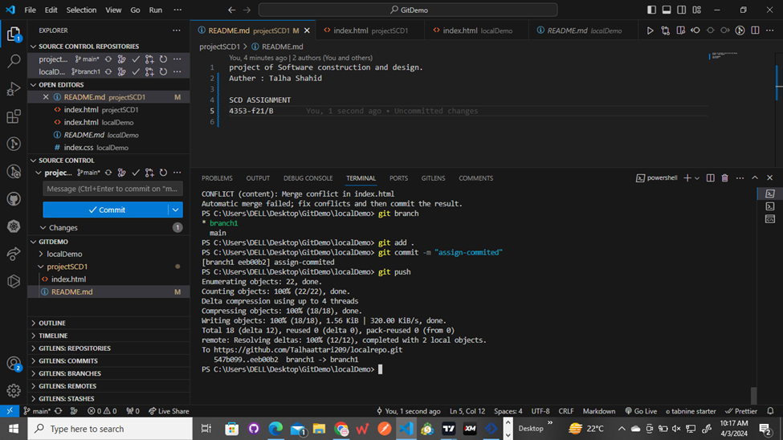
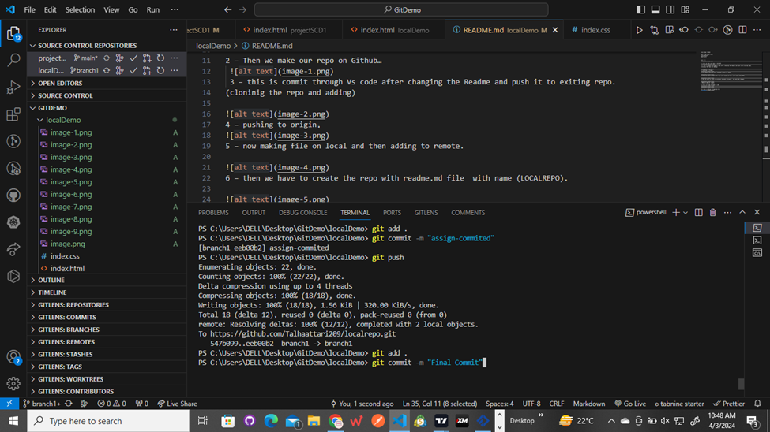
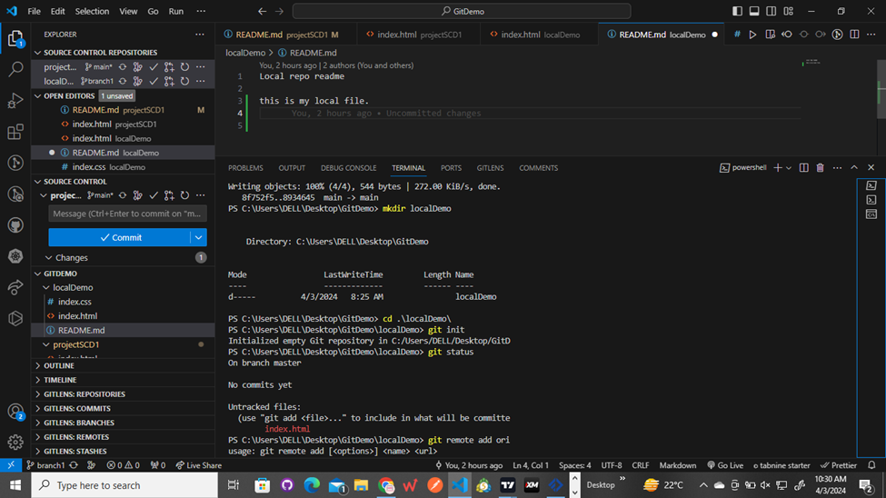
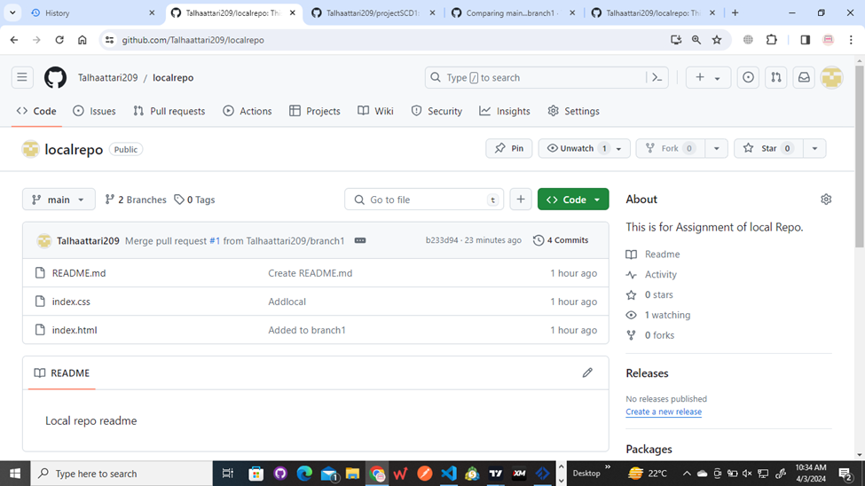
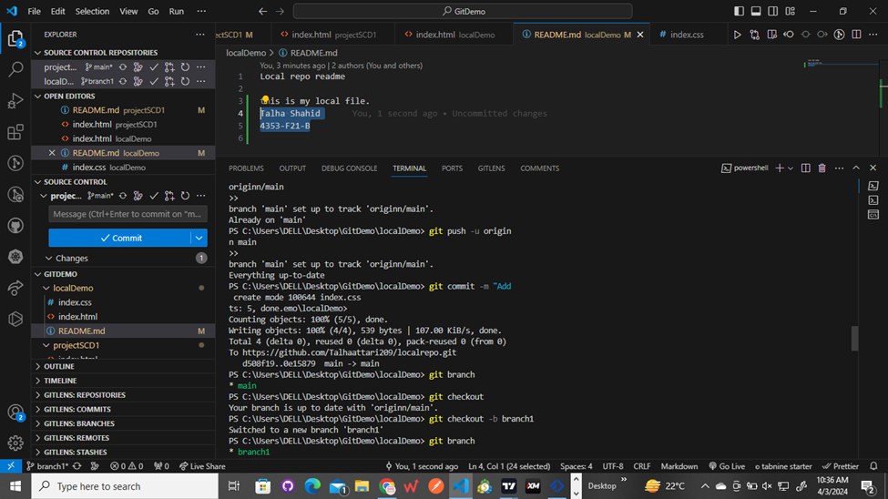
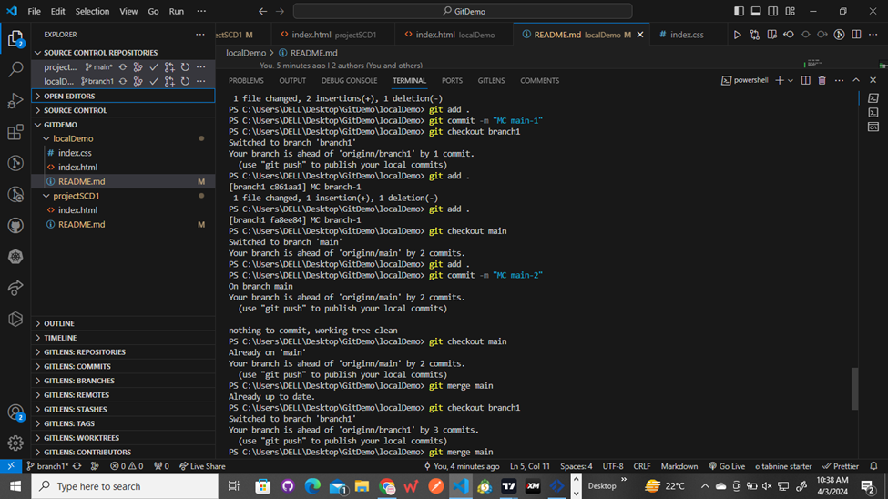
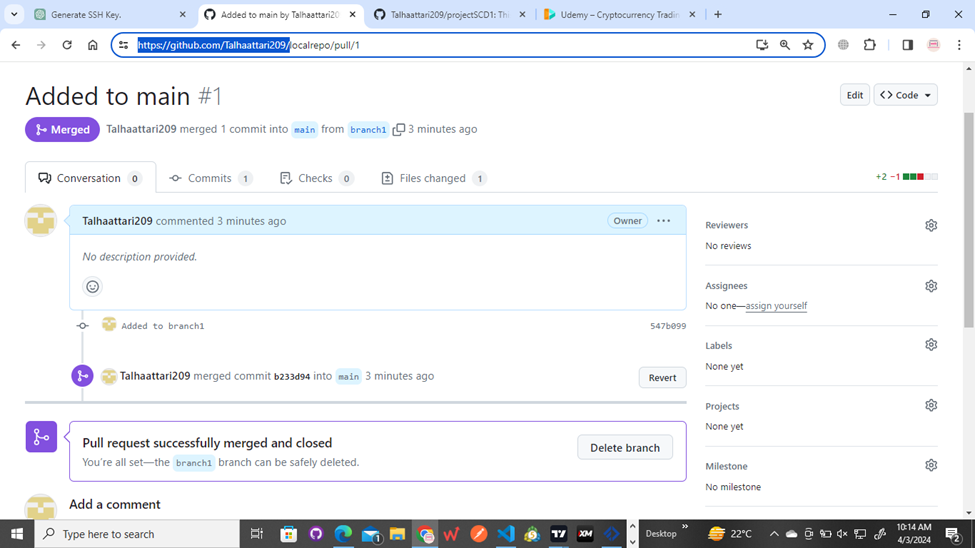

Local repo readme

this is my local file.
Talha Shahid
4353-F21-B

pics ----

2 – Then we make our repo on Github…
 
 3 – this is commit through Vs code after changing the Readme and push it to exiting repo.
(cloninig the repo and adding)

4 – pushing to origin, 

5 – now making file on local and then adding to remote.

6 – then we have to create the repo with readme.md file  with name (LOCALREPO).

7 – Now we have to fetch it with new variable (originn)  and push the changes.

8 –Now we add our images.

9 – this is Merge through VS code

10 – this is Merge through Git Hub
